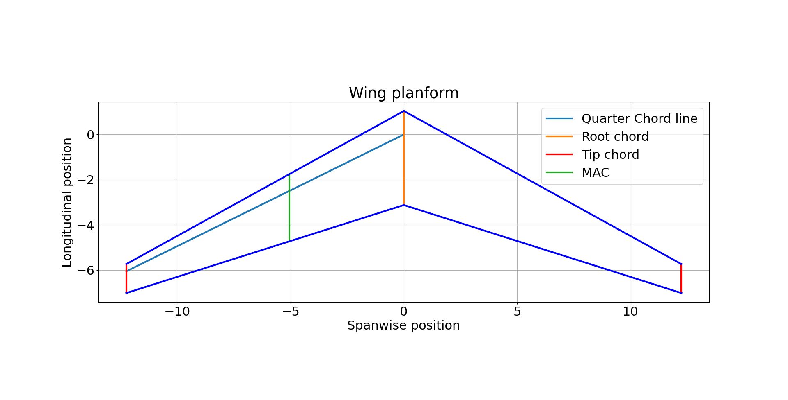

# ✈️ Wing planform
Draw the wing planform of a wing design using its governing parameters.

## Use
Put the correct parameters in 'wing_planform.py' and run the program. Make sure that the parameters are calculated correctly and are in line with each other. 

### Example image

